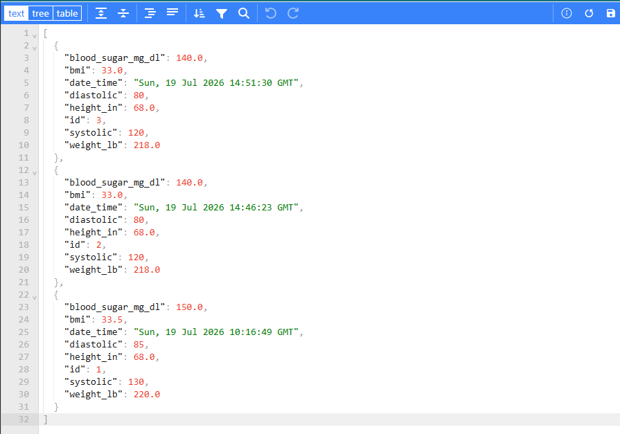
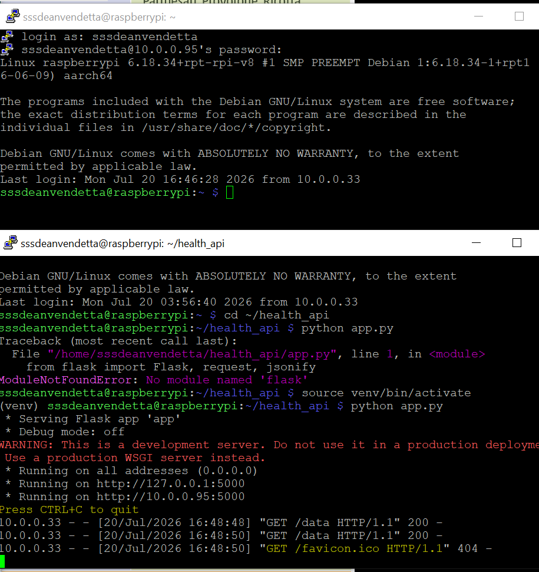
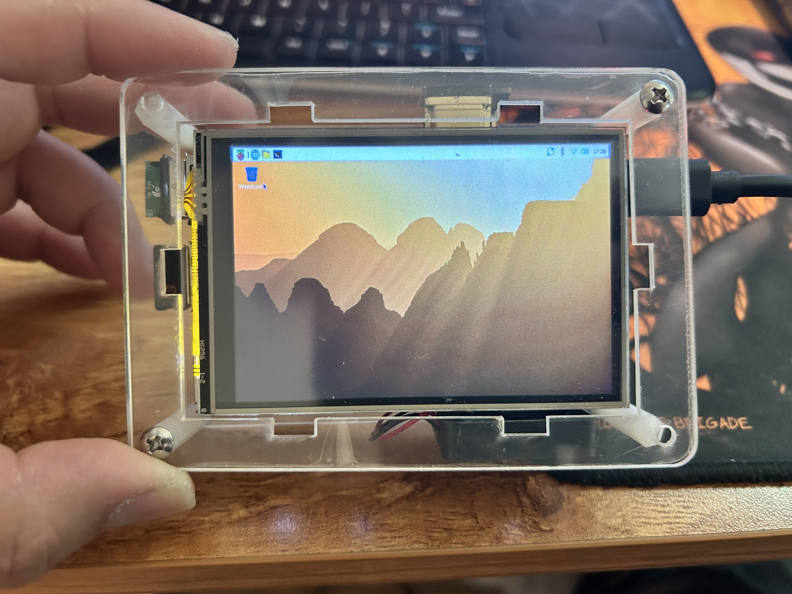

# Raspberry Pi Health Monitoring Server

## 🚀 Overview

This project is a full-stack health monitoring system deployed on a Raspberry Pi 4.
It collects and stores health metrics such as blood sugar, blood pressure, and weight, and exposes them through a REST API.

## One Command Startup

The application can be started using:

```bash
chmod +x run.sh
./run.sh

## 📊 Dashboard Features

- Dynamic chart switching (Blood Sugar, BP, Weight)
- Date range filtering (7, 30, All)
- Real-time summary metrics:
  - Average
  - Highest
  - Lowest
- Chronological data visualization
- REST API endpoints
- MariaDB data storage
- Raspberry Pi deployment

## 🧠 What This Demonstrates

* Linux server administration (SSH, networking)
* Database management (MariaDB)
* Backend API development (Flask)
* Secure configuration using environment variables
* Real-world debugging and system integration

## 🏗️ Architecture

Browser
|↓
Flask Web Server / REST API
|
↓
MariaDB Database
|
↓
Raspberry Pi 4 Linux Server

## ⚙️ Tech Stack

* Raspberry Pi 4
* Python (Flask)
* MariaDB
* Linux (Raspberry Pi OS)
* Git & GitHub

## Project Structure
raspberry-pi-health-server/
│
├── app.py
├── run.sh
├── requirements.txt
├── templates/
|   ├── home.html
│   └── dashboard.html
├── static/
│   ├── css/
│   └── js/
└── screenshots/


## 🔌 API Endpoints

### GET /data

Returns all stored health data in JSON format

### POST /add

Adds a new health record

Example:

```json
{
  "systolic": 120,
  "diastolic": 80,
  "blood_sugar": 140,
  "weight": 218,
  "height": 68,
  "bmi": 33
}
```

## 🔐 Security

* Database credentials stored using environment variables (.env)
* Dedicated database user with restricted permissions (no root access)

## 🛠️ Setup (Simplified)

1. Clone repo
2. Create virtual environment
3. Install dependencies
4. Configure `.env`
5. Run Flask server

## 📈 Future Improvements

* User authentication system
* Cloud deployment (AWS or Azure)
* Automated backups & monitoring
* Mobile application integration
* Docker deployment

## 💼 Why This Project Matters

This project simulates a real-world IT + backend system by combining:

* Server setup
* Database design
* API development
* Security practices

It reflects hands-on experience relevant to entry-level IT and software roles.

## 📸 Screenshots

### API Response (JSON Output)


### Flask Server Running on Raspberry Pi


### Raspberry Pi Setup

